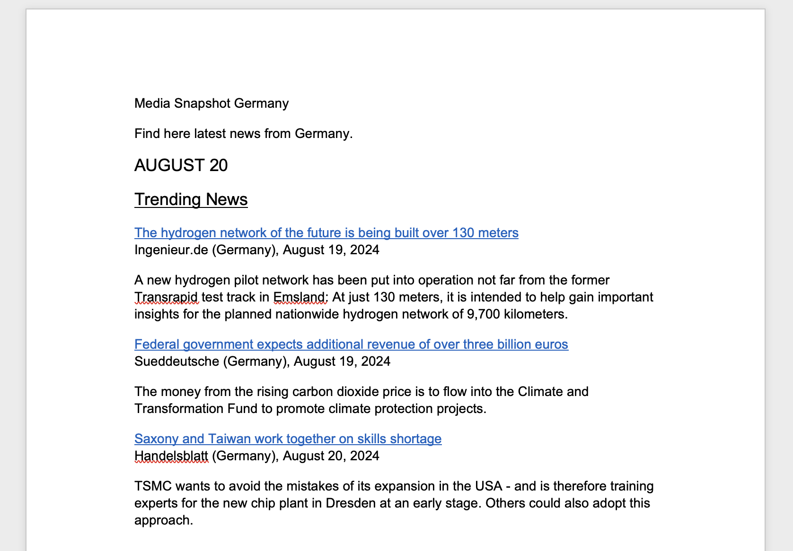

# Web Scraper for News Articles

## Overview

This project is a web scraper designed to extract news articles from various news websites based on your scope. This is supported for example for these outlets:

- Handelsblatt
- Wirtschaftswoche
- Der Spiegel

The extracted articles are translated into both English and German and then saved into a Word document. The selection of important articles is handled by a ChatGPT wrapper, and translations are powered by the DeepL API. To keep API costs low, articles are first of all filtered by date to only include recent articles. Additionally, the articles are embedded which allows extracting a similarity score between all articles. Articles about the same topic from different news sources are then filtered, keeping the article from the more prestigious news platform.

## Example output


## Features

- **Article Scraping:**  Scrape articles from top German news websites.
- **Intelligent Filtering:** Only important articles are selected for extraction, using a ChatGPT wrapper for context-aware decision-making. To edit the scope of selection, edit the prompt at Messages/introduction.txt
- **Multi-language Support:** Articles are automatically translated into English using the DeepL API.
- **Word Document Output:** The selected and translated articles are formatted and saved into a German and an English Word document for easy reading and distribution.

## Requirements

- Python 3.x
- Required Python packages (listed in `requirements.txt`)
- Access to the DeepL API
- A ChatGPT API key for the article selection process

## Installation

1. Clone this repository:

    ```bash
    # Clone the repository
    git clone https://github.com/anton325/speedreader.git

    # Navigate to the project directory
    cd MediaMonitoring

    # Install the required Python packages
    pip install -r requirements.txt
    ```


2. Set up your API keys:

    - **DeepL API**: You will need a DeepL API key for translation service. Insert yours in translate_articles.py
    - **ChatGPT API**: A ChatGPT API key is required for the intelligent article selection process, enter yours in api.py

    Add these keys to your environment variables or configure them in the script settings.

3. Run the main
    ```bash
    python main.py
    ```
Once the algorithm is terminated, the created Word Documents can be found in Briefings/

## Contributing

Contributions are welcome! Please feel free to fork the repository, make changes, and submit a pull request. Due to the modular construction of the webscraping, you can easily extend this project and write a scraping implementation for a newspaper thats currently not included. For that, you need to inspect the website and insert unique CSS identifiers for the components the template requires to work.

## License

This project is licensed under the MIT License - see the LICENSE file for details.